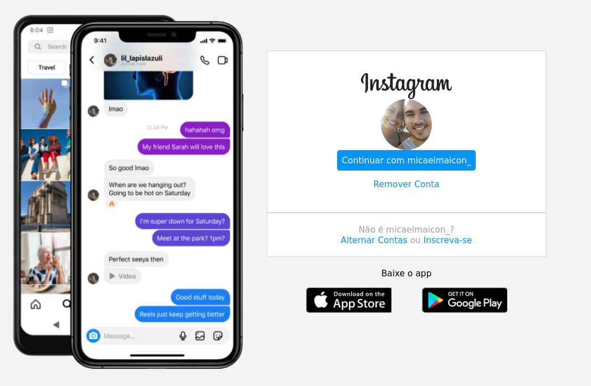

<h1 align="center"> 💬🗣 Bem vindo(a) ao CLONE DA TELA DE LOGIN DO INSTAGRAM 💬🗣</h1>

### Qual o propósito?
Fazer um clone da tela de login do Instagram, aplicando os conhecimentos e habilidades desenvolvidas sobre posicionamento com flexbox durante o bootcampo Impulso JavaScript. A recomendação é usar o CSS com flexbox como abordagem de posicionamento de elementos e aplicar responsividade.

### Como visualizar esse projeto?
Em breve disponibilizarei em meu portfólio... Mas é possível rodar esse projeto fazendo o clone do repositório. Em seguida abra-o em seu editor (recomendo VScode) e utilizando a extensão Live Server ou similar, rode-o localmente.

### Resultado 🎉🎉🎉
<section class="project_image">
  

    
  

</section>

<h1 align="center">💬🗣 Chega mais, vamos conversar 💬🗣</h1>

<section class="social_networks">
  
Para entrar em contato é só clicar no link abaixo! 

  

    
  
  
  
<section>